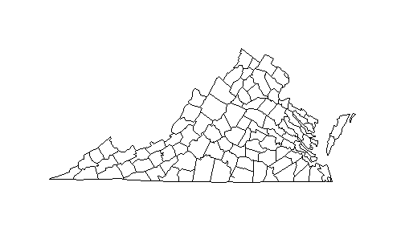
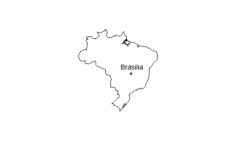
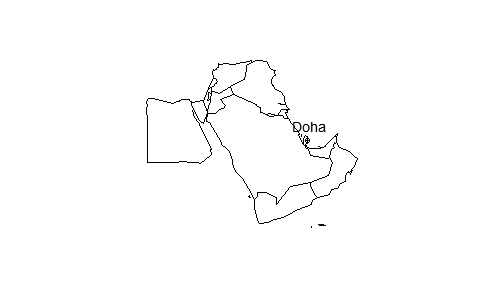

## Motivation
While watching the Coursera videos for the Developing Data Products under the Data Science Specialization, I noticed that the professor was using a product that had a World Map on it.  

Given the global scale of business and human interaction with people from many different cultures, I feel it is important to maintain a basic knowledge of other Countries their major cities.

---

## R Package Possibilities: United States Counties
By exploration of the R "maps" package I was impressed by how many map functions are available.  For instance, you can create a map of all of the counties in Virginia, like so:

```r
suppressWarnings(library(maps))
map('county', 'virginia')
```

 

---

## R Package Possibilities: Countries of the World
To create a map of Brazil, for example, and it's capital city, enter the code:

```r
m = map("world", "Brazil")
map.cities(country = "Brazil", capitals = 1)
```

 

---

## Interactive way to use Maps
For my Shiny Application, I generated a simple quiz with a checkbox to answer the question "Where is Doha?"  
Depending on the user's answer, the result would be plotted on the map generated below:

```r
m = map("world", c("Qatar", "Saudi Arabia", "United Arab Emirates", "Yemen",
                   "Oman", "Bahrain", "Egypt", "Iraq", "Israel", "Jordan",
                   "Kuwait", "Lebanon", "Oman", "Palestine", "Syria"))
map.cities(country = "Qatar", capitals = 1)
```

 
  
